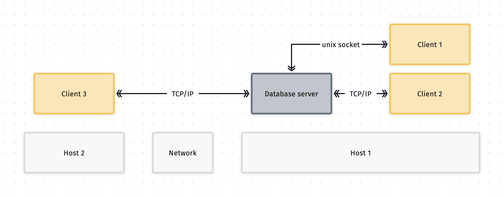

# Architecture

PostgreSQL is founded on a client/server model.
Clients will access the database server to interact with it.

The database server can handle multiple clients (your applications).

The client and the server are not necessarily on the same host, in that case they
can communicate via [TCP/IP](https://en.wikipedia.org/wiki/Internet_protocol_suite).

See further details in
the [official documentation](https://www.postgresql.org/docs/current/tutorial-arch.html).

## Client/server diagram

> The database server can expose unix sockets as well.
